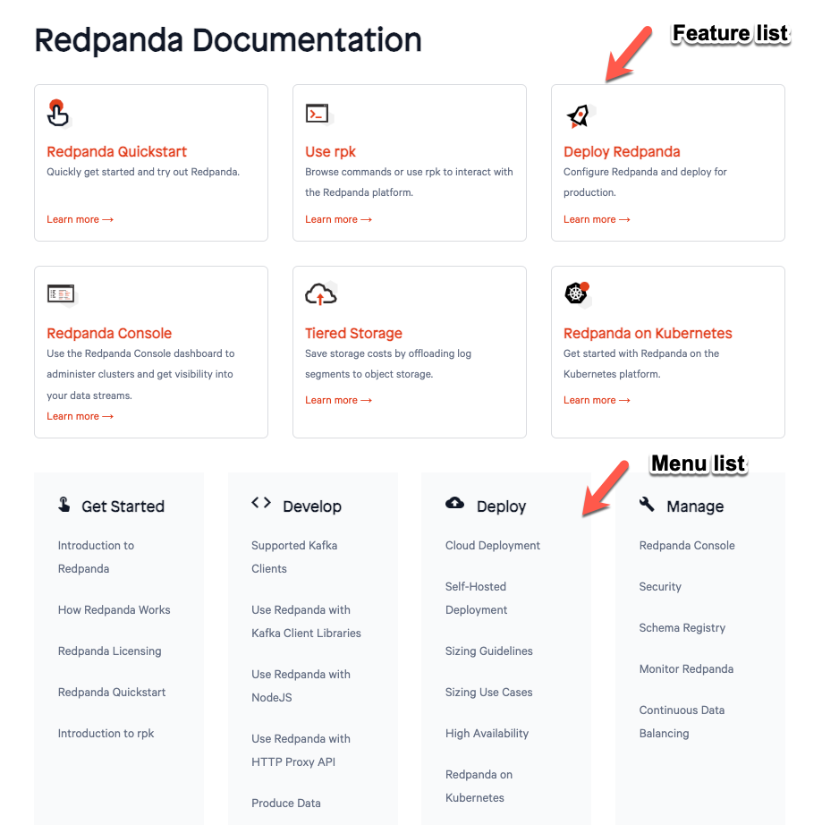

= Home Component
:url-docs: https://docs.redpanda.com
:url-org: https://github.com/redpanda-data
:url-docs: {url-org}/documentation
:url-ui: {url-org}/docs-ui
:url-extensions: {url-org}/docs-extensions-and-macros
:hide-uri-scheme:
:url-contributing: {url-org}/docs-site/blob/main/meta-docs/CONTRIBUTING.adoc
:url-netlify: https://netlify.com
:url-netlify-docs: https://docs.netlify.com
:url-antora-docs: https://docs.antora.org
:url-redoc: https://github.com/Redocly/redoc
:idprefix:
:idseparator: -
ifdef::env-github[]
:important-caption: :exclamation:
:note-caption: :paperclip:
endif::[]

This branch contains the content for the home page of the Redpanda documentation.

The home page is hosted in the {url-docs}/tree/home[`home` branch] and is configured as a dedicated component called `home` so that we can host it at the root of the site under the `/home` path.

The link:./antora.yml[`antora.yml`] file contains the content for the home page. This content is read by a template in the UI to produce the home page. The template for the home page is in the {url-ui}/blob/main/src/partials/home.hbs[`home.hbs`] file of the link:{url-ui}[`docs-ui` repository].

== Contributing

To learn how to use the playbook and generate the docs site locally, see our link:{url-contributing}[contributing guide].